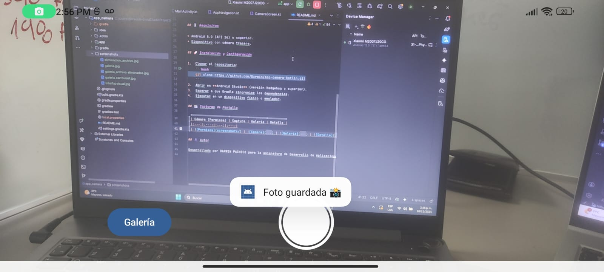
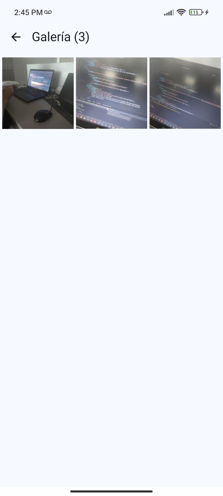

# 📸 MY CAMARA APP

Aplicación moderna de cámara y galería desarrollada nativamente para Android utilizando Kotlin y Jetpack Compose. Este proyecto demuestra el uso de APIs modernas como CameraX y manejo eficiente de almacenamiento.

## 📋 Características Principales

* **Captura Fotográfica:** Vista previa en tiempo real y captura de alta calidad usando CameraX.
* **Almacenamiento Seguro:** Las fotos se guardan en el almacenamiento privado de la app.
* **Galería Inteligente:** Visualización en cuadrícula  usando carga perezosa (Lazy Loading).
* **Visor de Detalles:** Visualización de fotos en pantalla completa con navegación tipo carrusel.
* **Gestión de Archivos:** Funcionalidad para eliminar fotos con diálogo de confirmación.

## 🛠️ Tecnologías Utilizadas

* **Lenguaje:** Kotlin
* **Interfaz (UI):** Jetpack Compose (Material Design 3)
* **Cámara:** Android Jetpack CameraX
* **Carga de Imágenes:** Coil
* **Navegación:** Navigation Compose
* **Permisos:** Accompanist Permissions

## 📱 Requisitos

* Android 8.0 (API 26) o superior.
* Dispositivo con cámara trasera.

## 🚀 Instalación y Configuración

1.  Clonar el repositorio:
    ```bash
    git clone https://github.com/Dxrwin/app-camera-kotlin.git
    ```
2.  Abrir en **Android Studio** (versión Hedgehog o superior).
3.  Esperar a que Gradle sincronice las dependencias.
4.  Ejecutar en un dispositivo físico o emulador.

## 📸 Capturas de Pantalla

|           Cámara (Permisos)           |                   Captura                    |               Galería               |                    Detalle                     |
|:-------------------------------------:|:--------------------------------------------:|:-----------------------------------:|:----------------------------------------------:|
|  |  |  |  |

## 👤 Autor

Desarrollado por DARWIN PACHECO para la asignatura de Desarrollo de Aplicaciones Móviles.
